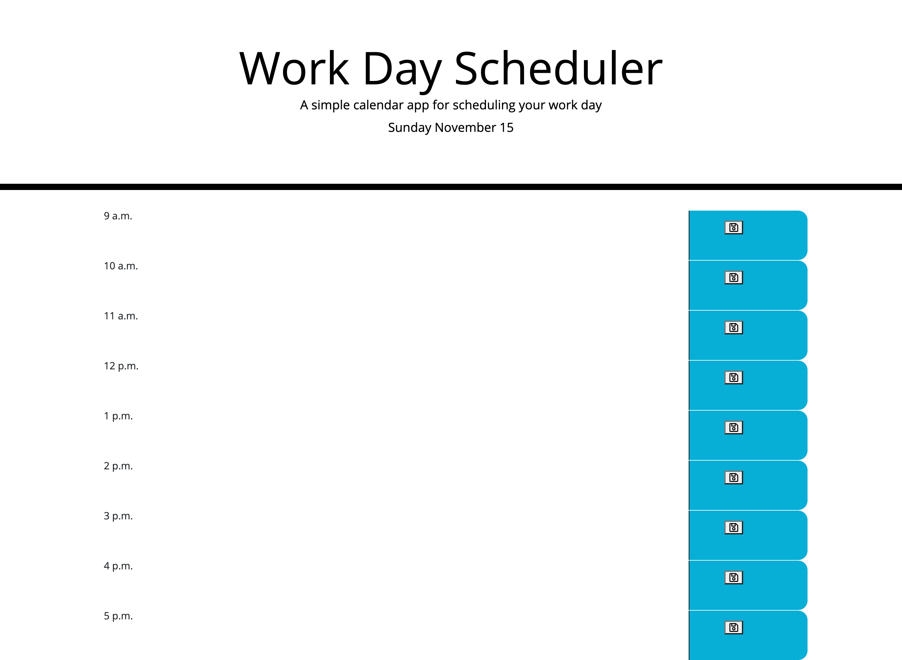

# Work Day Scheduler

Here is a refactoring of the code needed to create an interactive calendar website that will help schedule one's work day. The application uses HTML, CSS, JavaScript, jQuery, and moment to create an interactive interface that will respond dynamically to the date, time of day, and user input. 

Here is a link to the published website: https://jyc5331.github.io/calendar/

